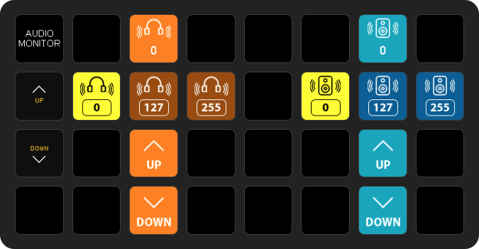

## Blackmagic Design AudioMonitor 12G

This module will connect to the Blackmagic Design AudioMonitor 12G device.

#### Version 3

This module is only compatible with version 3 of Bitfocus Companion and above. If you have used a previous version of the module, it is easy to build a new one very quickly as it is feature complete with Actions, Feedback and multiple Presets.

#### Configuration

- Enter the IP address for your device. ie. 192.168.10.50
- Enter the port address for your device. The default port for the device is 9996.

#### Actions

The following actions are available:

* **Audio Meter**

    This can be changed to: VU (-20dBFS Ref), VU (-18dBFS Ref), PPM EBU (-20dBFS Ref), PPM EBU (-18dBFS Ref), PPM BBC (-20dBFS Ref), PPM BBC (-18dBFS Ref), Loudness (EBU +9scale) or Loudness (EBU +18 scale).

* **Audio Input**

    This can be changed to: SDI Stereo 3-4, SDI Stereo 3-4, SDI Stereo 5-6, SDI Stereo 7-8, SDI Stereo 9-10, SDI Stereo 11-12, SDI Stereo 13-14, SDI Stereo 15-16, XLR AES/EBU Stereo 1-2, XLR Analog Stereo or RCA Stereo.

* **Mute**

    This be changed to: Off or On

* **Solo**

    This can be changed to: Off, Left or Right

* **Headphone Volume**

    This can be set to a desired value. Range is between 0 and 255. Default is set 0.

* **Headphone Volume (Up)**

    This can be set to a desired incremental value. Range is between 1 and 20. Default is set 5.

* **Headphone Volume (Down)**

   This can be set to a desired incremental value. Range is between 1 and 20. Default is set 5.

* **Speaker Volume**

    This can be set to a desired value. Range is between 0 and 255. Default is set 0.

* **Speaker Volume (Up)**

    This can be set to a desired incremental value. Range is between 1 and 20. Default is set 5.

* **Speaker Volume (Down)**

    This can be set to a desired decremental value. Range is between 1 and 20. Default is set 5.

#### Feedbacks

The following feedbacks are available:

* **Audio Meter**

    This can be set to the desired style based on the selected ***audio meter*** value.

* **Audio Input**

    This can be set to the desired style based on the selected ***audio input*** value.

* **Mute**

    This can be set to the desired style based on the selected ***mute*** value.

* **Solo**

    This can be set to the desired style based on the selected ***solo*** value.

* **Headphone Volume**

    This can be set to the desired style based on the selected ***heaphone volumne*** value.

* **Speaker Volume**

    This can be set to the desired style based on the selected ***speaker volumne*** value.

#### Presets

Presets are avaiable in 3 formats:

1. **Basic** - All buttons have a default background colour of dark grey. The feeback background is set to yellow.

2. **Colored** - Each button group has a selected background color. The feeback background is set to yellow.

3. **Images** - Each button group has a selected background color and each button has a unique transparent image. The feeback has a correspoding unique transparent image and the background is set to yellow.

The following presets are available in each format:

* **Audio Meter (8 Presets)**

    Presets for each of the following: VU (-20dBFS Ref), VU (-18dBFS Ref), PPM EBU (-20dBFS Ref), PPM EBU (-18dBFS Ref), PPM BBC (-20dBFS Ref), PPM BBC (-18dBFS Ref), Loudness (EBU +9scale) and Loudness (EBU +18 scale).

* **Audio Input (11 Presets)**

    Presets for each of the following: SDI Stereo 3-4, SDI Stereo 3-4, SDI Stereo 5-6, SDI Stereo 7-8, SDI Stereo 9-10, SDI Stereo 11-12, SDI Stereo 13-14, SDI Stereo 15-16, XLR AES/EBU Stereo 1-2, XLR Analog Stereo and RCA Stereo.

* **Mute - Off**

* **Mute - On**
  
* **Solo - Off**

* **Solo - Left**

* **Solo - Right**
   
* **Headphone Volume - Set to 0**

* **Headphone Volume - Set to 127**

* **Headphone Volume - Set to 255**
    
* **Headphone Volume (Up)- Set to 5**

* **Headphone Volume (Down)- Set to 5**

* **Speaker Volume - Set to 0**

* **Speaker Volume - Set to 127**

* **Speaker Volume - Set to 255**
    
* **Speaker Volume (Up)- Set to 5**

* **Speaker Volume (Down)- Set to 5**   

#### Variables

The following variables are available:

* **Audio Meter**

    ***$(audiomonitor:audio_input)*** Returns the selected ***audio meter*** value.

* **Audio Input**

    ***$(audiomonitor:audio_meter)*** Returns the selected ***audio input*** value.

* **Mute**

    ***$(audiomonitor:mute)*** Returns the selected ***mute*** value.

* **Solo**

    ***$(audiomonitor:solo)*** Returns the selected ***solo*** value.

* **Headphone Volume**

    ***$(audiomonitor:monitor_headphone_volume)*** Returns the selected ***heaphone volume*** value.

* **Speaker Volume**

    ***$(audiomonitor:monitor_speaker_volume)*** Returns the selected ***speaker volume*** value.

